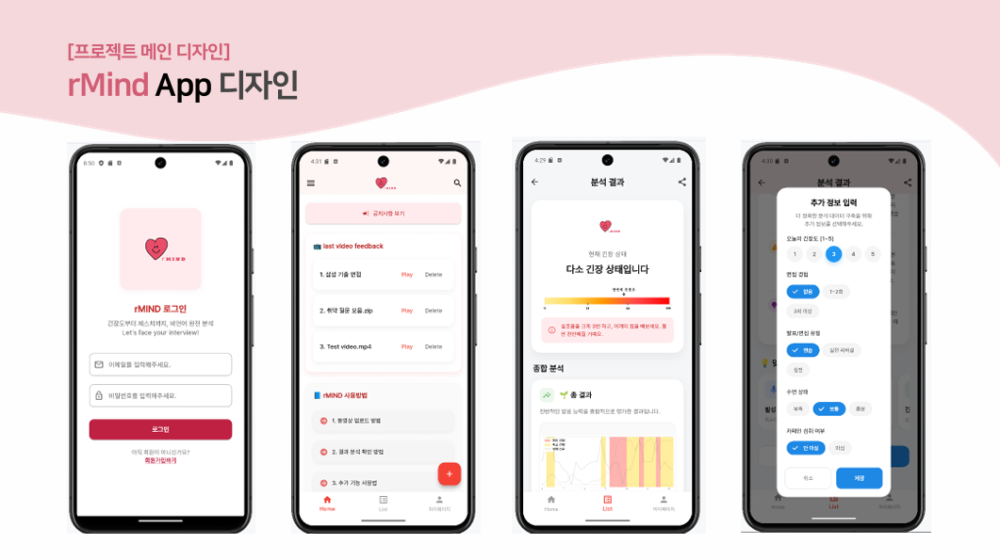
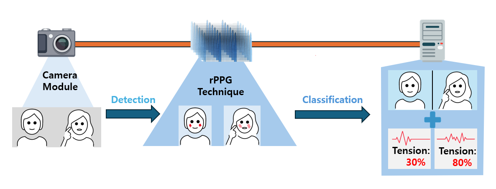

# rMind: Non-Invasive Interview Feedback Platform

rMind는 카메라 기반 **원격 광혈류 측정(remote photoplethysmography, rPPG)** 기술을 활용해  
면접 상황에서 나타나는 **비언어적 반응**을 분석하고 시각화하는 모바일 면접 코칭 플랫폼입니다.

---

## 🎯 개발 배경 및 목적

기존 AI 면접 플랫폼들은 텍스트·음성 위주의 평가에 집중하여, 표정이나 시선 같은 **비언어적 요소**를 놓치는 한계가 있었습니다.  
rMind는 이러한 문제를 해결하기 위해 **별도의 장비 없이 스마트폰 카메라만으로(비접촉식 rPPG)** 생체 신호를 정밀하게 분석합니다.  
이를 통해 사용자는 자신의 긴장도와 태도를 객관적으로 파악하고, 스스로 면접 역량을 강화할 수 있습니다.

---

  

---

## 📝 주요 기능

- **비접촉 생체 신호 분석**: rPPG 알고리즘(CHROM, POS, ICA)으로 영상에서 심박수(BPM)를 정밀 추정
- **비언어적 행동 분석**:
  - **눈 깜빡임**: 시선 불안정 및 집중도 분석
  - **신체 움직임**: 머리 및 상체 움직임을 통한 자세 안정성 평가
- **직관적인 결과 시각화**:
  - **긴장 구간 식별**: BPM 급상승 구간을 타임라인으로 표시하여 긴장 시점 파악 (예: 01:40 ~ 02:21)
  - **종합 리포트**: 항목별 점수와 직관적인 그래프 제공
- **AI 코칭 및 피드백**: 분석 결과에 따른 '잘한 점', '보완할 점' 등 맞춤형 행동 가이드 제공

---

  

---

## ⚙️ 사용 기술

| Domain                | Tech Stack                           |
| :-------------------- | :----------------------------------- |
| **Frontend**          | Flutter (Dart)                       |
| **Backend**           | FastAPI (Python)                     |
| **Computer Vision**   | OpenCV, Dlib, Haar Cascade           |
| **Signal Processing** | NumPy, SciPy (rPPG: CHROM, POS, ICA) |
| **Data Format**       | JSON, CSV, PNG                       |

---

## 📂 시스템 구조

1. **모바일 앱 (Flutter)**

   - 로그인 / 회원가입
   - 면접 영상 업로드
   - 상세 분석 결과 및 긴장 구간 피드백 확인

2. **분석 서버 (FastAPI)**

   - 영상 수신 및 저장
   - rPPG 기반 심박 추출, 눈 깜빡임, 얼굴 움직임 분석
   - 결과 이미지·JSON 생성

3. **저장 및 시각화 계층**
   - 분석 결과 파일 저장
   - 앱으로 그래프 및 지표 전달

---

## 🚀 기대 효과

- 면접 준비 과정에서 **스스로의 비언어적 약점**을 객관적으로 파악
- 심박수 변화에 따른 **긴장 구간을 정확히 인지**하여 대처 능력 향상
- 기존 답변 중심 시스템과 차별화된 **정량적 생체 신호 기반**의 실질적 피드백 제공
